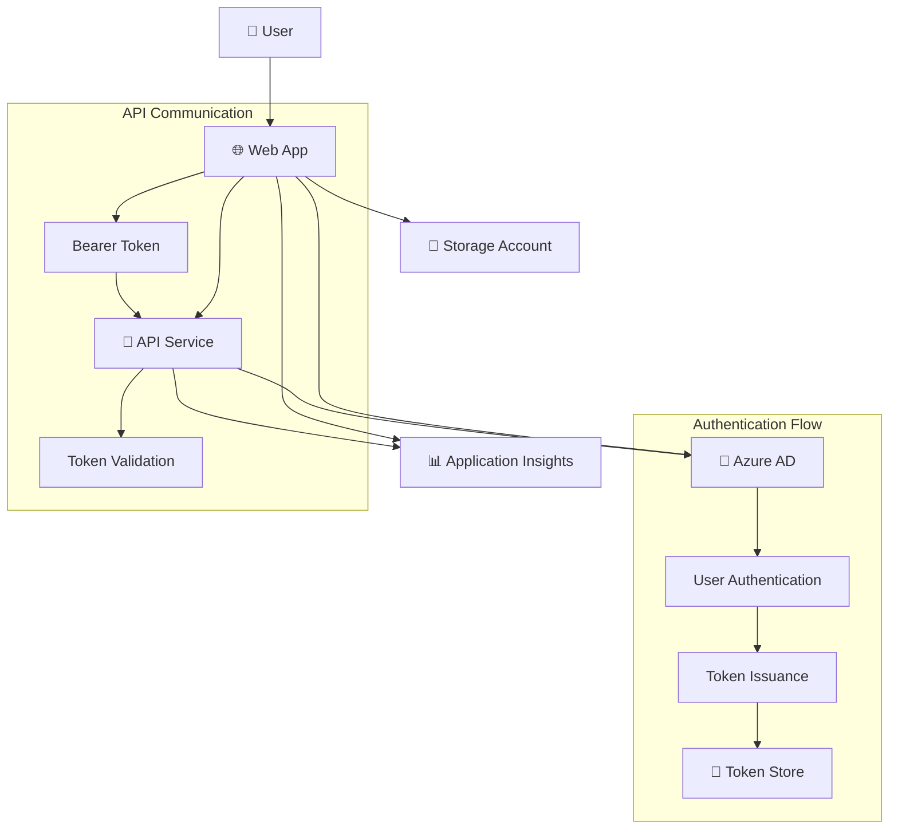

# 🔐 Azure App Service with Authentication & Downstream API

This project demonstrates a complete Azure App Service solution with Azure Active Directory authentication, including a web application and a downstream API service for secure token-based communication.

## 🏗️ Architecture Overview



## ✨ Features

- 🔐 **Dual App Service Authentication**: Both web app and API with Azure AD
- 🎫 **Token Management**: Complete JWT token handling and validation
- 🔗 **Secure API Communication**: Bearer token authentication between services
- 🌐 **Modern Web Interface**: Clean, responsive demo application with token inspection
- 📊 **Application Insights**: Built-in monitoring for both services
- 🛡️ **Security Best Practices**: HTTPS only, secure headers, minimal permissions
- 🏗️ **Infrastructure as Code**: Complete Bicep/ARM templates for both services
- 🚀 **One-Click Deployment**: Automated deployment of infrastructure and code

## 🚀 Quick Start

### Prerequisites

- Azure CLI installed and logged in
- Azure subscription with appropriate permissions
- PowerShell (for deployment script)

### 1. Clone and Navigate

```powershell
cd "15. App Service Authentication and Downstream Token"
```

### 2. Deploy Everything with One Command

```powershell
.\deploy.ps1 -ResourceGroupName "rg-auth-demo" -AppServiceName "my-auth-app" -APIServiceName "my-auth-api" -StorageAccountName "myauthstorage123" -ClientId "your-client-id-here" -ClientSecret "your-client-secret-here"
```

The script will:
- ✅ Create Azure AD App Registration (if needed)
- ✅ Deploy web app infrastructure
- ✅ Deploy API infrastructure  
- ✅ Configure authentication for both services
- ✅ Deploy web app code automatically
- ✅ Deploy API code automatically
- ✅ Set up all required configuration

### 3. Access Your Application

After deployment completes:
- 🌐 **Web App**: `https://your-app-name.azurewebsites.net`
- 🔗 **API**: `https://your-api-name.azurewebsites.net`

## 📋 Deployment Parameters

| Parameter | Type | Description | Default |
|-----------|------|-------------|---------|
| `ResourceGroupName` | string | Resource group name | Required |
| `AppServiceName` | string | Web app service name | Required |
| `APIServiceName` | string | API service name | `{AppServiceName}-api` |
| `APIClientId` | string | API Azure AD Client ID | Uses main ClientId if not provided |
| `StorageAccountName` | string | Storage account name (3-24 chars) | Required |
| `ClientId` | string | Azure AD App Registration Client ID | Required |
| `ClientSecret` | string | Azure AD Client Secret | Required for API |
| `AppServicePlanSku` | string | Service plan SKU (B1, S1, P1V2, P1V3) | `B1` |
| `DeploySampleApp` | bool | Deploy sample web application | `true` |
| `DeployAPI` | bool | Deploy API service | `true` |
| `Location` | string | Azure region | `East US` |

## 🔑 Authentication Configuration

### Web App Authentication
- **Provider**: Azure Active Directory
- **Require Authentication**: Yes
- **Unauthenticated Action**: Redirect to login
- **Token Store**: Enabled with 72-hour refresh

### API Authentication  
- **Provider**: Azure Active Directory
- **Token Validation**: Bearer token validation
- **CORS**: Configured for web app communication
- **Claims Processing**: Automatic user claims extraction
- **Client ID**: Can use separate Azure AD app registration for enhanced security

### 🔐 Client ID Configuration Options

#### Option 1: Single Client ID (Default)
- Both web app and API use the same Azure AD app registration
- Simpler setup with one app registration to manage
- Suitable for development and simple scenarios

#### Option 2: Separate Client IDs (Recommended for Production)
- Web app has its own Azure AD app registration
- API has its own Azure AD app registration  
- Enhanced security with proper separation of concerns
- Follows enterprise security best practices
- Use `-APIClientId` parameter to specify separate API client ID

## 🌐 Available Endpoints

### Web App Endpoints
| Endpoint | Description |
|----------|-------------|
| `/` | Main application (requires auth) |
| `/.auth/login/aad` | Azure AD login |
| `/.auth/logout` | Logout |
| `/.auth/me` | User claims and token info |

### API Endpoints
| Endpoint | Description |
|----------|-------------|
| `/` | API health check |
| `/health` | Detailed health status |
| `/api/welcome` | Protected welcome endpoint |
| `/api/auth-info` | Authentication information |

## 🎫 Token Management & Inspection

The web application provides comprehensive token inspection:

### Token Display Features
- 📋 **Full JWT Token**: Complete token with copy functionality
- 🔍 **Claims Table**: Formatted display of all token claims
- ✅ **Authentication Status**: Real-time auth verification
- 🚀 **API Testing**: Live downstream API call demonstration

### Token Claims Available
- `name` - User display name
- `preferred_username` - User email
- `aud` - Token audience
- `iss` - Token issuer  
- `exp` - Expiration time
- `iat` - Issued at time
- `roles` - User roles (if configured)
- And many more...

## 🔗 API Communication Pattern

The solution demonstrates secure service-to-service communication:

```javascript
// Web App calls API with Bearer token
const response = await fetch('https://your-api.azurewebsites.net/api/welcome', {
    headers: {
        'Authorization': `Bearer ${idToken}`,
        'Content-Type': 'application/json'
    }
});
```

```javascript
// API validates token and extracts user info
const clientPrincipal = req.headers['x-ms-client-principal'];
const userInfo = JSON.parse(Buffer.from(clientPrincipal, 'base64').toString('utf-8'));
```

## 🔍 Monitoring and Troubleshooting

### Application Insights Integration
Both services include comprehensive monitoring:
- 📊 Authentication success/failure rates
- ⚡ API response times and errors
- 👥 User behavior analytics
- 🔍 Detailed error tracking

### Health Checks
- Web app: Authentication status monitoring
- API: Service health endpoints with uptime tracking

## 🔐 Security Features

### Production Security
- ✅ HTTPS enforced on all endpoints
- ✅ Secure token storage with automatic refresh
- ✅ CORS properly configured
- ✅ Security headers implemented
- ✅ Minimal permission principle applied

### Token Security
- Tokens stored in secure App Service token store
- Automatic token refresh prevents expiration
- Logout clears all stored tokens
- Bearer token validation on API endpoints

## 📁 Project Structure

```
15. App Service Authentication and Downstream Token/
├── 🌐 WebApp/
│   ├── index.html              # Clean, production-ready web app
│   └── web.config             # IIS configuration
├── 🔗 API/
│   ├── server.js              # Clean Node.js API server
│   ├── package.json           # Dependencies
│   └── web.config             # Node.js configuration
├── 📄 main.bicep              # Web app infrastructure
├── 📄 api-main.bicep          # API infrastructure  
├── 📄 azuredeploy.json        # Generated ARM template (web app)
├── 📄 api-deploy.json         # Generated ARM template (API)
├── 🚀 deploy.ps1              # Complete deployment script
├── 📄 parameters.json         # Deployment parameters
└── 📚 README.md               # This documentation
```

## 🎯 Use Cases

This solution is perfect for:
- 🏢 **Enterprise Applications**: Secure internal apps with AD integration
- 🔗 **Microservices Architecture**: Service-to-service authentication
- 📱 **Modern Web Apps**: SPA applications with API backends
- 🎓 **Learning & Demos**: Understanding Azure authentication patterns

## 🆘 Support & Troubleshooting

### Common Issues
1. **Authentication Loops**: Verify redirect URIs in Azure AD
2. **API 401 Errors**: Check client secret configuration
3. **Token Refresh Issues**: Verify token store settings

### Debug Commands
```bash
# Check web app auth config
az webapp auth show --resource-group "rg-auth-demo" --name "my-auth-app"

# Check API auth config
az webapp auth show --resource-group "rg-auth-demo" --name "my-auth-api"

# View logs
az webapp log tail --resource-group "rg-auth-demo" --name "my-auth-app"
```

## 🎉 Getting Started

Ready to deploy? Just run:

```powershell
.\deploy.ps1 -ResourceGroupName "my-rg" -AppServiceName "my-app" -StorageAccountName "mystorage123" -ClientId "your-client-id" -ClientSecret "your-secret"

# With separate API Client ID (recommended for production)
.\deploy.ps1 -ResourceGroupName "my-rg" -AppServiceName "my-app" -APIClientId "your-api-client-id" -StorageAccountName "mystorage123" -ClientId "your-client-id" -ClientSecret "your-secret"
```

That's it! Your secure, authenticated web application with API backend will be ready in minutes! 🚀 