# 🔐 Azure App Service with Authentication & Downstream Token

This project demonstrates how to deploy an Azure App Service with Azure Active Directory authentication enabled, including token management for downstream API calls.

## 🏗️ Architecture Overview

```mermaid
graph TB
    User[👤 User] --> AppService[🌐 App Service]
    AppService --> AAD[🔑 Azure AD]
    AppService --> Storage[💾 Storage Account]
    AppService --> AppInsights[📊 Application Insights]
    AAD --> TokenStore[🎫 Token Store]
    AppService --> DownstreamAPI[🔗 Downstream APIs]
    
    subgraph "Authentication Flow"
        AAD --> UserAuth[User Authentication]
        UserAuth --> TokenIssue[Token Issuance]
        TokenIssue --> TokenStore
    end
```



## ✨ Features

- 🔐 **Azure AD Authentication**: Built-in App Service authentication
- 🎫 **Token Management**: Automatic token refresh and storage
- 🔗 **Downstream API Support**: Ready for calling downstream APIs with user tokens
- 🌐 **Modern Web Interface**: Clean, responsive demo application
- 📊 **Application Insights**: Built-in monitoring and telemetry
- 🛡️ **Security Best Practices**: HTTPS only, secure headers, minimal permissions
- 🏗️ **Infrastructure as Code**: Complete Bicep/ARM templates

## 🚀 Quick Start

### Prerequisites

- Azure CLI installed and logged in
- Azure subscription with appropriate permissions
- Azure AD App Registration (see setup guide below)

### 1. Clone and Navigate

```powershell
cd "15. App Service Authentication and Downstream Token"
```

### 2. Set Up Azure AD App Registration

First, create an App Registration in Azure AD:

```bash
# Create App Registration
az ad app create --display-name "AppService-Auth-Demo" --sign-in-audience "AzureADMyOrg"

# Get the Application (Client) ID
az ad app list --display-name "AppService-Auth-Demo" --query "[0].appId" -o tsv
```

### 3. Deploy Using PowerShell Script

```powershell
.\deploy.ps1 -ResourceGroupName "rg-auth-demo" -AppServiceName "my-auth-app" -StorageAccountName "myauthstorage123" -ClientId "your-client-id-here"
```

### 4. Configure App Registration

After deployment, update your App Registration with the redirect URI:
- Go to Azure Portal → Azure Active Directory → App registrations
- Select your app → Authentication → Add platform → Web
- Add redirect URI: `https://your-app-name.azurewebsites.net/.auth/login/aad/callback`

### 5. Set Client Secret

```bash
# Create client secret
az ad app credential reset --id "your-client-id" --append

# Update App Service setting
az webapp config appsettings set --resource-group "rg-auth-demo" --name "my-auth-app" --settings MICROSOFT_PROVIDER_AUTHENTICATION_SECRET="your-client-secret"
```

## 📋 Deployment Parameters

| Parameter | Type | Description | Default |
|-----------|------|-------------|---------|
| `appServiceName` | string | Name of the App Service | Required |
| `storageAccountName` | string | Storage account name (3-24 chars, lowercase) | Required |
| `clientId` | string | Azure AD App Registration Client ID | Required |
| `appServicePlanSku` | string | App Service Plan SKU (F1, B1, S1, P1V2, P1V3) | `B1` |
| `deploySampleApp` | bool | Deploy the sample web application | `true` |
| `tenantId` | string | Azure AD Tenant ID | Current subscription tenant |

## 🔑 Authentication Configuration

The deployment configures Azure AD authentication with the following settings:

### Global Validation
- **Require Authentication**: `true`
- **Unauthenticated Action**: Redirect to login page
- **Default Provider**: Azure Active Directory

### Token Store
- **Enabled**: `true`
- **Token Refresh**: 72 hours
- **Cookie Expiration**: 8 hours
- **Directory**: `/home/data/.auth`

### Security Headers
- `X-Content-Type-Options: nosniff`
- `X-Frame-Options: DENY`
- `X-XSS-Protection: 1; mode=block`

## 🌐 Available Endpoints

| Endpoint | Description |
|----------|-------------|
| `/` | Main application (requires auth) |
| `/.auth/login/aad` | Azure AD login |
| `/.auth/logout` | Logout |
| `/.auth/me` | User claims and token info |
| `/.auth/refresh` | Refresh tokens |

## 🎫 Token Management

The sample application demonstrates how to:

1. **Check Authentication Status**: Verify if user is logged in
2. **Display User Claims**: Show user information from Azure AD
3. **Access Token Metadata**: Display token expiration and refresh info
4. **Handle Token Refresh**: Automatic token renewal

### Getting User Tokens for Downstream APIs

```javascript
// Fetch user information and tokens
fetch('/.auth/me')
  .then(response => response.json())
  .then(data => {
    const accessToken = data[0].access_token;
    const userClaims = data[0].user_claims;
    
    // Use access token for downstream API calls
    fetch('https://api.example.com/data', {
      headers: {
        'Authorization': `Bearer ${accessToken}`
      }
    });
  });
```

## 🔍 Monitoring and Troubleshooting

### Application Insights
The deployment includes Application Insights for monitoring:
- Authentication events
- Application performance
- Error tracking
- User behavior analytics

### Common Issues

1. **Authentication Loops**: Check redirect URI configuration
2. **Token Refresh Failures**: Verify client secret is set correctly
3. **Permission Errors**: Ensure App Registration has required permissions

### Debug Authentication

```bash
# Check authentication configuration
az webapp auth show --resource-group "rg-auth-demo" --name "my-auth-app"

# View app service logs
az webapp log tail --resource-group "rg-auth-demo" --name "my-auth-app"
```

## 🔐 Security Considerations

### Production Deployment Checklist

- [ ] Use Azure Key Vault for client secrets
- [ ] Configure custom domains with SSL certificates
- [ ] Enable diagnostic logging
- [ ] Set up monitoring alerts
- [ ] Review and minimize Azure AD permissions
- [ ] Configure network restrictions if needed
- [ ] Enable backup and disaster recovery

### Token Security

- Tokens are stored securely in the App Service token store
- Automatic token refresh prevents expiration issues
- Logout clears all stored tokens
- HTTPS is enforced for all authentication flows

## 📁 Project Structure

```
15. App Service Authentication and Downstream Token/
├── 📄 main.bicep                    # Main infrastructure template
├── 📄 azuredeploy.json             # Generated ARM template
├── 📄 parameters.json              # Sample deployment parameters
├── 📄 deploy.ps1                   # PowerShell deployment script
├── 📄 deploy-to-azure.html         # Web deployment interface
├── 📄 azuredeploy.visualizer.html  # Architecture visualization
├── 📄 README.md                    # This comprehensive guide
├── 📄 STRUCTURE.md                 # Project structure documentation
└── 📁 WebApp/                      # Sample web application
    ├── 📄 index.html               # Authentication demo page
    └── 📄 web.config               # IIS configuration
```

## 🚀 Advanced Scenarios

### Custom Claims and Roles

Configure additional claims in your Azure AD App Registration:
1. Go to Token configuration in your App Registration
2. Add optional claims (groups, roles, etc.)
3. Update application to use custom claims

### Multi-tenant Applications

For multi-tenant scenarios:
1. Change `sign-in-audience` to `AzureADMultipleOrgs`
2. Update tenant validation in the Bicep template
3. Handle tenant-specific logic in your application

### API Permissions for Downstream Calls

Grant API permissions to call Microsoft Graph or other APIs:

```bash
# Grant Microsoft Graph permissions
az ad app permission add --id "your-client-id" --api 00000003-0000-0000-c000-000000000000 --api-permissions e1fe6dd8-ba31-4d61-89e7-88639da4683d=Scope

# Grant admin consent
az ad app permission admin-consent --id "your-client-id"
```

## 📚 Additional Resources

- [Azure App Service Authentication Documentation](https://docs.microsoft.com/en-us/azure/app-service/overview-authentication-authorization)
- [Azure AD OAuth 2.0 Flow](https://docs.microsoft.com/en-us/azure/active-directory/develop/v2-oauth2-auth-code-flow)
- [Token Store Configuration](https://docs.microsoft.com/en-us/azure/app-service/configure-authentication-provider-aad)
- [Downstream API Patterns](https://docs.microsoft.com/en-us/azure/active-directory/develop/scenario-web-app-call-api-overview)

## 🆘 Support

For issues or questions:
1. Check the troubleshooting section above
2. Review Azure App Service logs
3. Consult Azure AD sign-in logs
4. Review Application Insights telemetry

---

**🎯 Ready to deploy?** Run the deployment script and start building authenticated applications with downstream API access! 